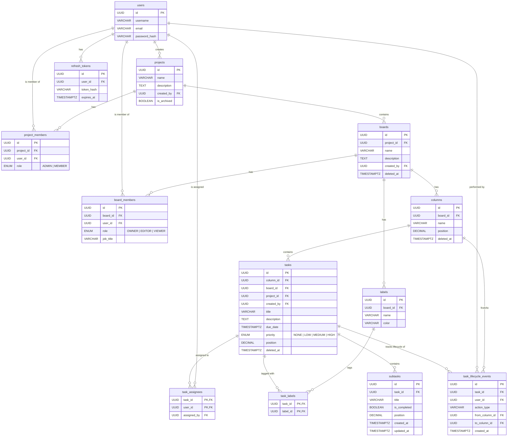

# Mini Kanban Board — Entity Relationship Diagram

```mermaid
erDiagram
    users ||--o{ projects : "creates"
    users ||--o{ project_members : "is member of"
    users ||--o{ board_members : "is member of"
    users ||--o{ refresh_tokens : "has"
    projects ||--o{ project_members : "has"
    projects ||--o{ boards : "contains"
    boards ||--o{ board_members : "has"
    boards ||--o{ columns : "has"
    boards ||--o{ labels : "has"
    columns ||--o{ tasks : "contains"
    tasks ||--o{ task_assignees : "assigned to"
    users ||--o{ task_assignees : "is assigned"
    tasks ||--o{ task_labels : "tagged with"
    tasks ||--o{ subtasks : "contains"
    labels ||--o{ task_labels : "tags"
    tasks ||--o{ task_lifecycle_events : "tracks lifecycle of"
    users ||--o{ task_lifecycle_events : "performed by"
    columns ||--o{ task_lifecycle_events : "from/to"

    users {
        UUID id PK
        VARCHAR username
        VARCHAR email
        VARCHAR password_hash
    }

    refresh_tokens {
        UUID id PK
        UUID user_id FK
        VARCHAR token_hash
        TIMESTAMPTZ expires_at
    }

    projects {
        UUID id PK
        VARCHAR name
        TEXT description
        UUID created_by FK
        BOOLEAN is_archived
    }

    project_members {
        UUID id PK
        UUID project_id FK
        UUID user_id FK
        ENUM role "ADMIN | MEMBER"
    }

    boards {
        UUID id PK
        UUID project_id FK
        VARCHAR name
        TEXT description
        UUID created_by FK
        TIMESTAMPTZ deleted_at
    }

    board_members {
        UUID id PK
        UUID board_id FK
        UUID user_id FK
        ENUM role "OWNER | EDITOR | VIEWER"
        VARCHAR job_title
    }

    columns {
        UUID id PK
        UUID board_id FK
        VARCHAR name
        DECIMAL position
        TIMESTAMPTZ deleted_at
    }

    labels {
        UUID id PK
        UUID board_id FK
        VARCHAR name
        VARCHAR color
    }

    tasks {
        UUID id PK
        UUID column_id FK
        UUID board_id FK
        UUID project_id FK
        UUID created_by FK
        VARCHAR title
        TEXT description
        TIMESTAMPTZ due_date
        ENUM priority "NONE | LOW | MEDIUM | HIGH"
        DECIMAL position
        TIMESTAMPTZ deleted_at
    }

    task_assignees {
        UUID task_id PK,FK
        UUID user_id PK,FK
        UUID assigned_by FK
    }

    task_labels {
        UUID task_id PK,FK
        UUID label_id PK,FK
    }

    subtasks {
        UUID id PK
        UUID task_id FK
        VARCHAR title
        BOOLEAN is_completed
        DECIMAL position
        TIMESTAMPTZ created_at
        TIMESTAMPTZ updated_at
    }

    task_lifecycle_events {
        UUID id PK
        UUID task_id FK
        UUID user_id FK
        VARCHAR action_type
        UUID from_column_id FK
        UUID to_column_id FK
        TIMESTAMPTZ created_at
    }
```
