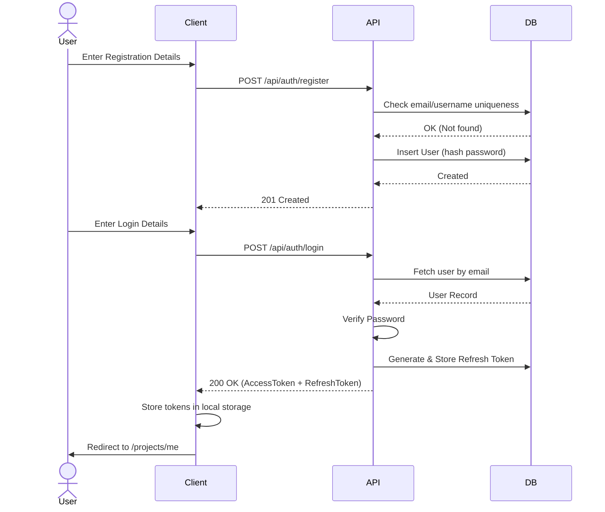
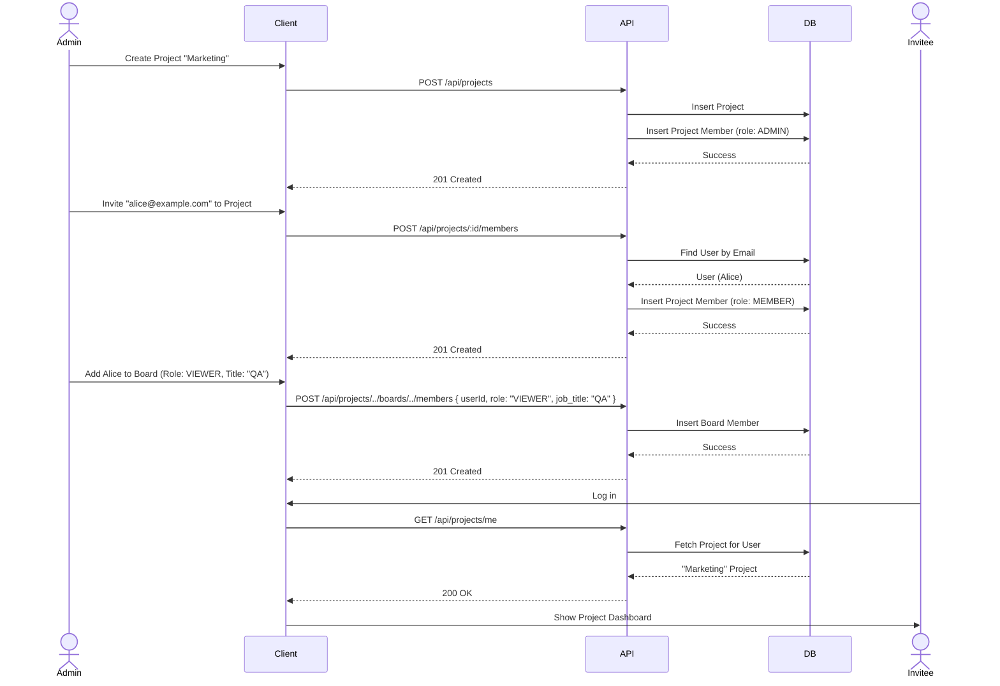
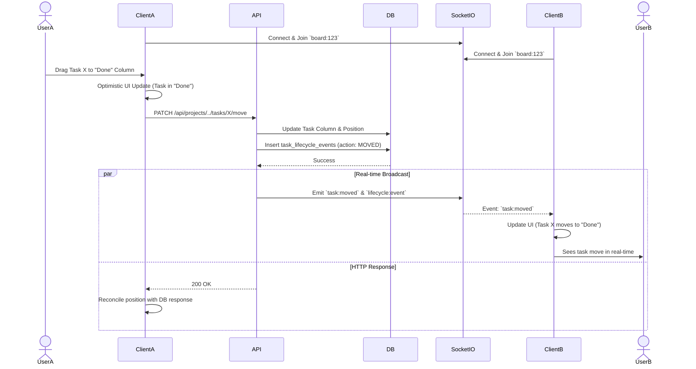
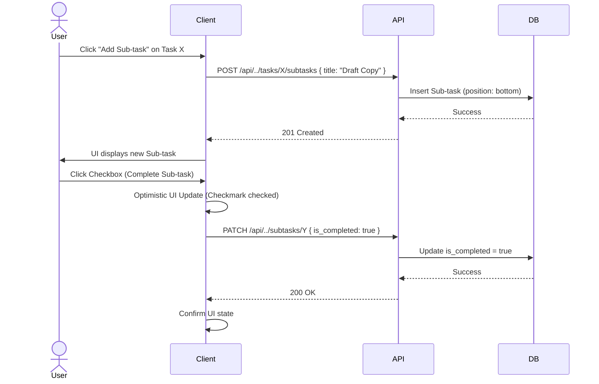
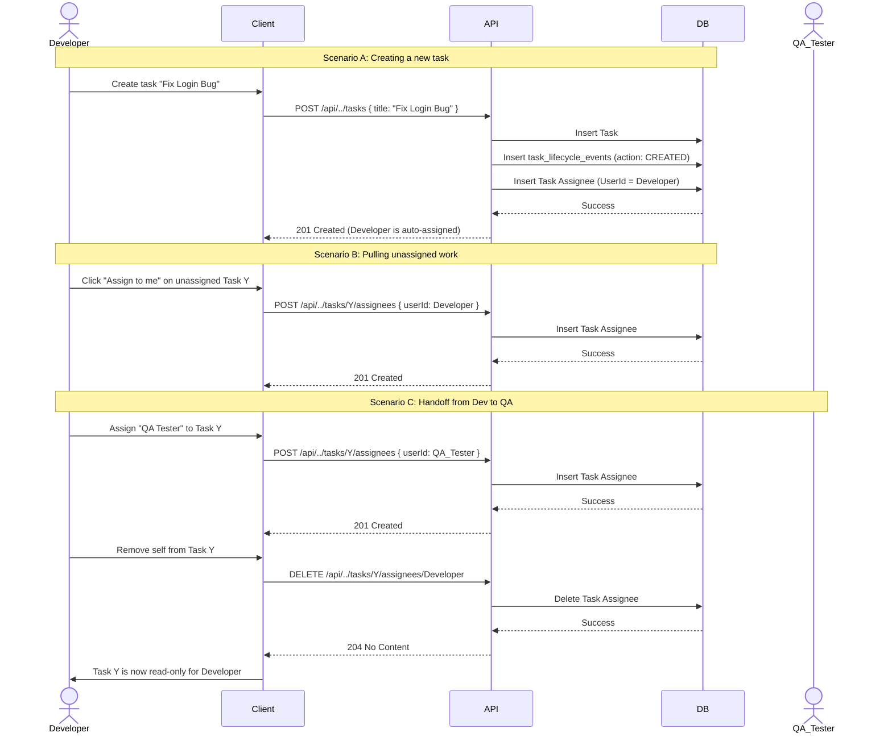

# Mini Kanban Board — Sequence Diagrams

This document outlines the interaction between the Client, API, Database, and Real-time server (Socket.io) for major activities in the application.

## 1. User Registration & Login (Auth Flow)

This sequence covers a new user registering and immediately logging in to receive their JWT access and refresh tokens.

---

## 2. Project Creation & Member Invitation

This sequence outlines how a user creates a project (automatically becoming an Admin) and invites another registered user to collaborate.

---

## 3. Real-time Task Movement (Drag & Drop)

This sequence demonstrates the optimistic UI update pattern and real-time Socket.io broadcasting when multiple users are viewing the same board.

---

## 4. Sub-task Management (Checklist)

This sequence demonstrates creating and completing a sub-task on a specific task card.

---

## 5. Task Creation, Pulling, & Handoff (Strict Ownership)

This sequence demonstrates how regular members (Viewers) interact with tasks under the strict ownership model.

